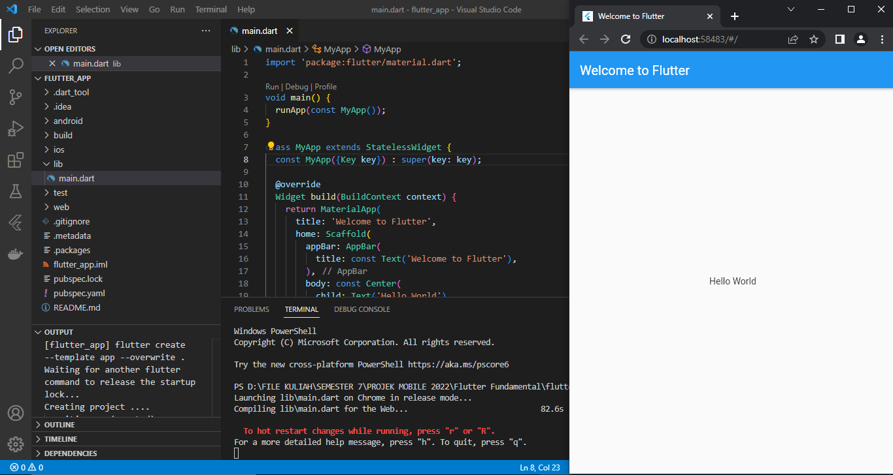
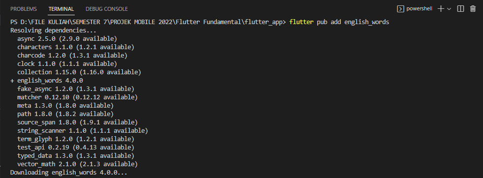
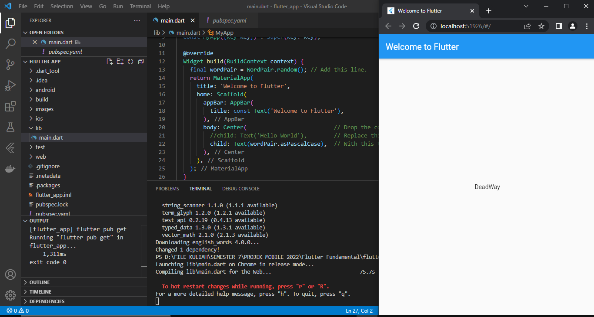
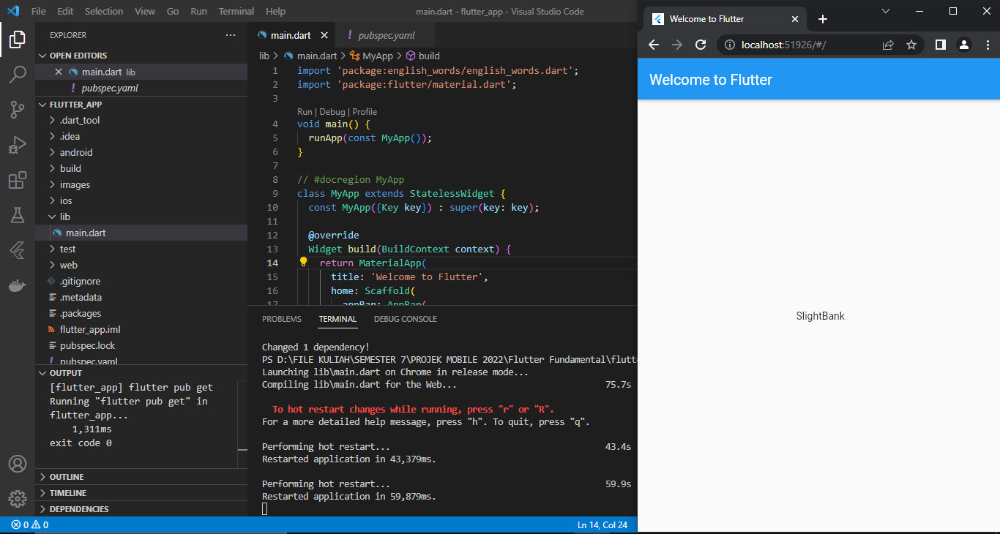
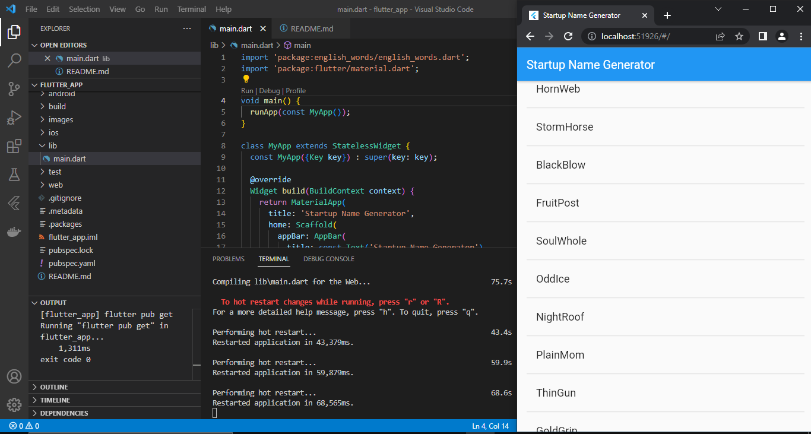

# flutter_app

## Membuat Aplikasi Flutter Pemula
Membuat aplikasi flutter dengan menampilkan hello world ditengah layar

## Menggunakan Paket Eksternal
Menggunakan paket source code english_words yang berisi beberapa ribu kata bahasa inggris dengan cara mendownload paket tersebut

Setiap aplikasi di hot reload maka akan menampilkan kata berbahasa inggris secara acak ketika aplikasi dijalankan

## Menambahkan Widget Statefull
Pada langkah ini akan menambahkan widget stateful, RandomWords, yang membuat class State, _RandomWordsState. kemudian akan menggunakan RandomWords sebagai anak di dalam MyAppwidget stateless yang ada.

## Menggunakan ListView
Pada langkah ini akan menambahkan widget listview yang dapat menampilkan data kata berbahasa inggris dengan bisa discroll kebawah 

